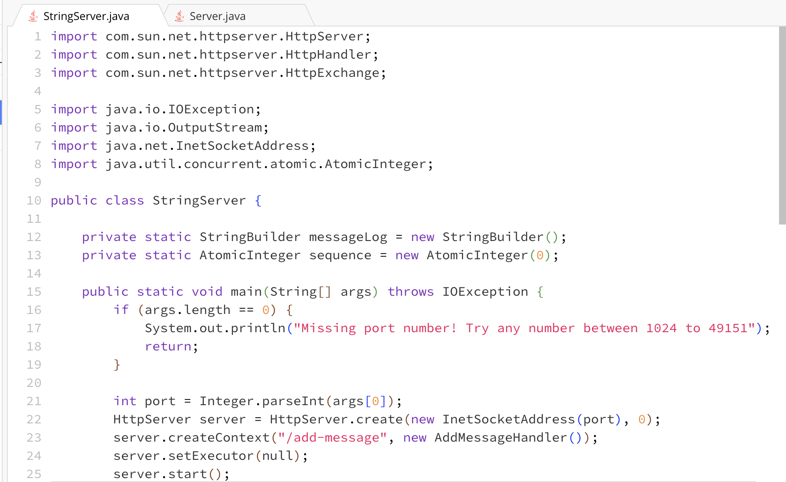
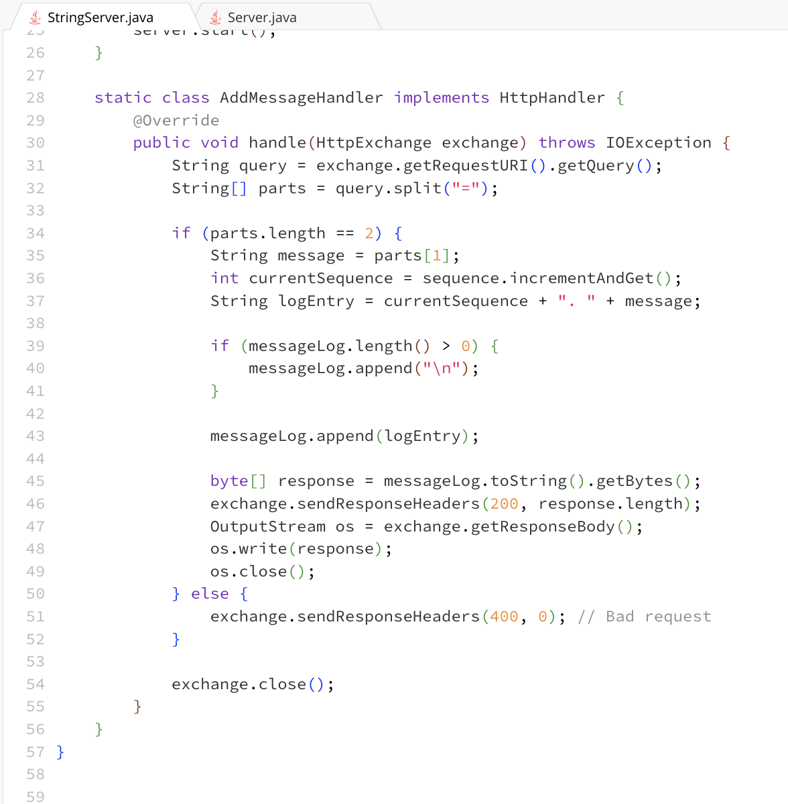
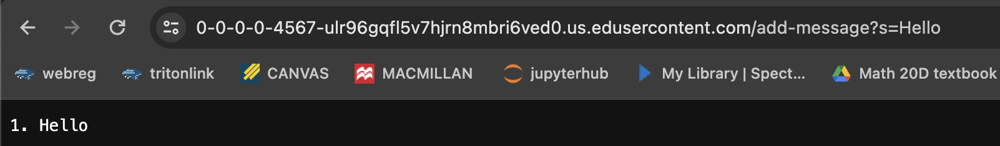
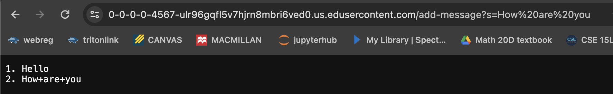
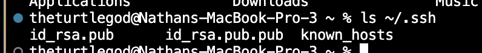

**LAB REPORT 2**

*Part 1*

code for String Server

addmessages screenshots

- the 'handle' method within the 'AddMessageHandler' class is called
- the relevant arguments is 'exchange' and some relevant fields are 'messageLog' and 'sequence' whose values are initially empty and 0 respectfully
- 'messageLog' stays empty since it is the first request while 'sequence' is incremented to 1 because it is the first message, the log entry '1.Hello' is also added to the 'messageLog'.

- the 'handle' method within 'AddMessageHandler'is called 
- the relevant arguments is 'exchange' and some relevant fields are 'messageLog' and 'sequence' whose values are "1.Hello" and 1 respectfully.
- 'sequence' is incremented to 2 in order to reflect the second message and then a newline character and the log entry "2.How are you" are added to the 'messageLog' which now contains both messages.

*Part 2*

path to private key

path to public key

terminal with no password

*Part 3*

From lab these past few weeks I have learned quite alot, especially since everything that's been taught is brand new to me.
Although it has been relatively difficult, some new skills I have acquired are accessing a remote computer from my own terminal and learning basic different terminal commands and shortcuts.

