LAB REPORT 3

*Part 1 : BUGS*

Failure
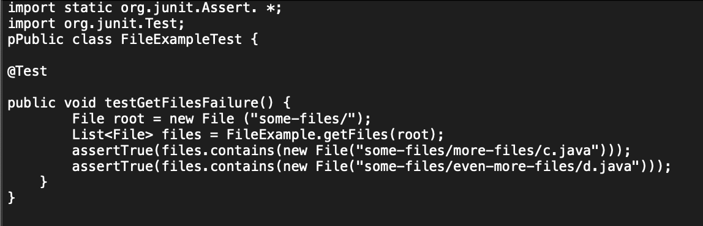

No Failure
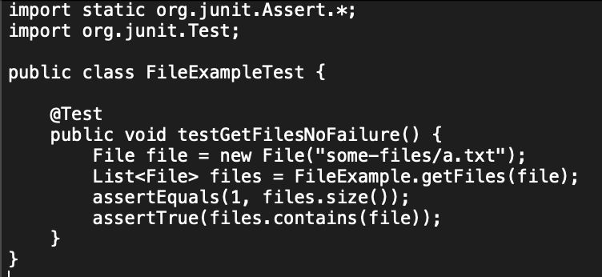

Symptom

Bug (before)
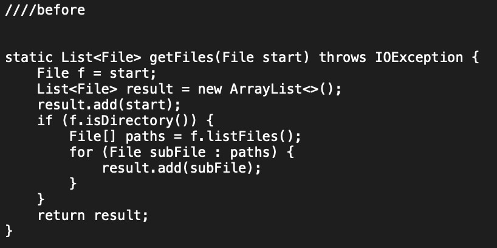

Bug (after)

The fix addresses the issue because it ensures that the 'getFiles' method
works correctly not only for the the directory inputs but also the file 
inputs. It correctly lists all the files in the given subdirectories as 
well as the directories.

*Part 2 : Researching Commands*
Chosen Command: "find"

*-name [Name]*

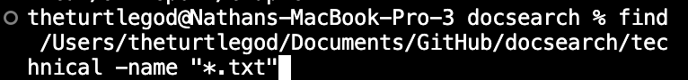
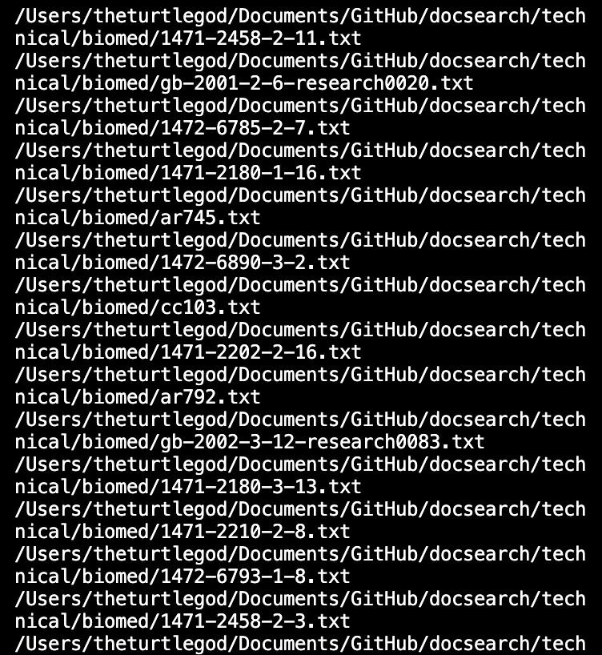
Finds all files with the ".txt" extension within the directory and subdirectories
and lists them in terminal. Useful for finding files with a specific extension.

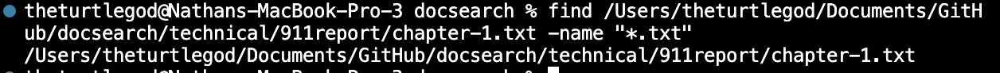
Finds if the file contains the ".txt" extension and will print out that pathway if
so. Useful for finding files with specific extension within the file.

*-type d [Directories]*

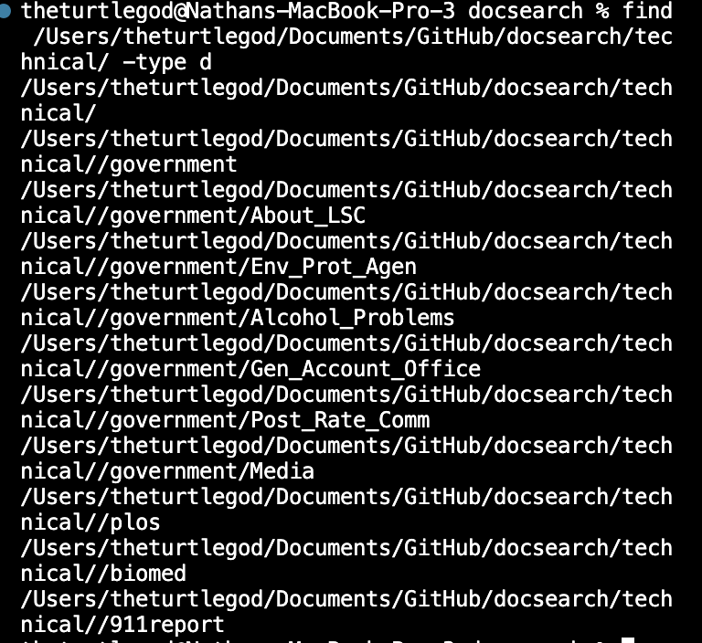
Find all the directories as well as subdirectories within this specific path. Useful
for locating directories when there are too many files to go scroll through.

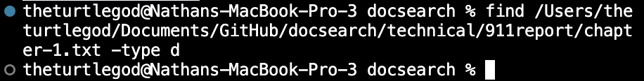
Tries to find directories within the file but doesn't work because a file was in argument.
Useful for locating directories but useless when given a file in pathway as argument.

*-type f [Within Modified TimeFrame (7 Days) ]*

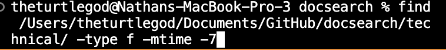
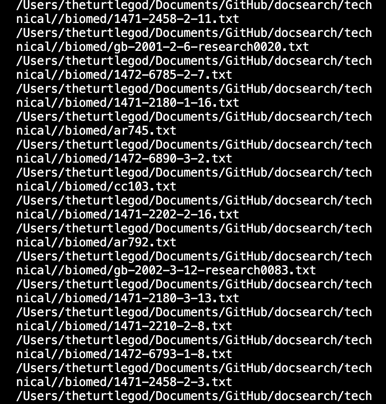
Finds all the files modified within the specific number of days and in this
case its 7. Useful for locating recently modified files. 

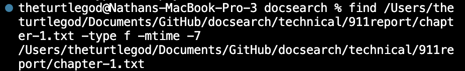
Finds if the file chosen was modified within the specific number of days and 
in this case its 7. Useful for indicating whether or not the file was worked on.

*-type f -empty [Empty Files]*

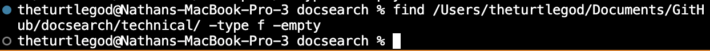
Checks if there are empty files in this directory and in this case
there isn't any empty files. Useful to check whether the directory
contains any empty files.

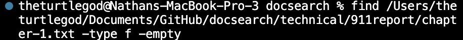
Checks if the given file is empty or not and in this case the file 
isn't empty. Useful to check if the file is empty or not.

*ChatGPT Inputs and Outputs* 

I provided ChatGPT with the buggy code and then asked it to provide 
- a failure inducing input as Junit test
- an input that doesn't induce a failure
- the bug as before and after code change required to fix it
- brifely describe why the fix addresses the issue

Output: 
- ChatGPT gave me several code blocks addressing each issue
specifically but I copied the code onto TextEdit then screenshotted
each and uploaded the files onto Github to paste into this lab
for part 1 (BUGS).

I also asked ChatGPT "what are some interesting line options or alternate
ways to use the 'find' ". 

Output: 
- provided several options of using find in the command line, an example 
of the output, and why it is useful. How I changed the output was I obviously 
used my own pathway and modified the command to my liking. I also wrote why 
each command was useful based off what I think would be useful not from 
ChatGPT.

