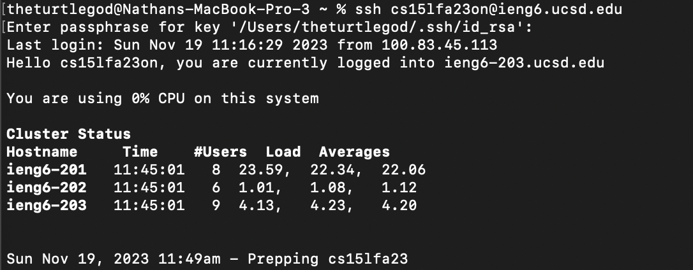
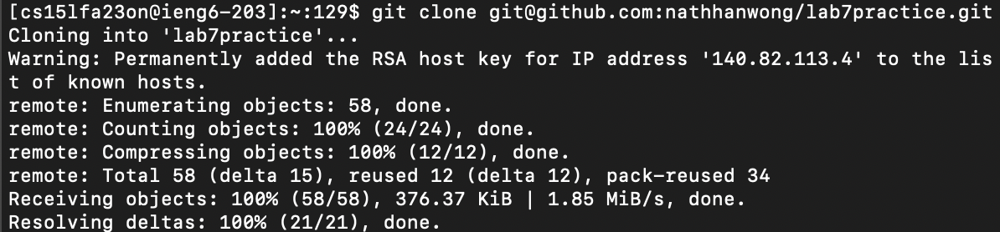
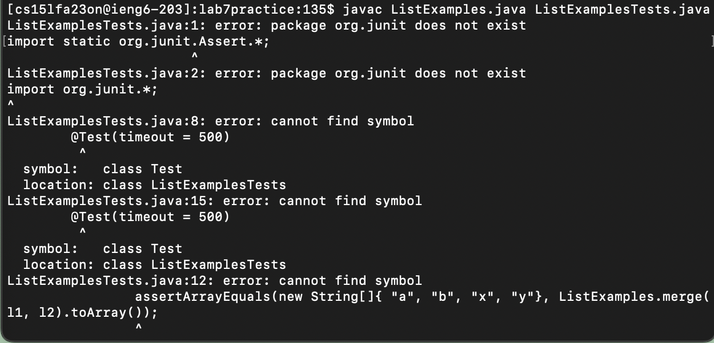
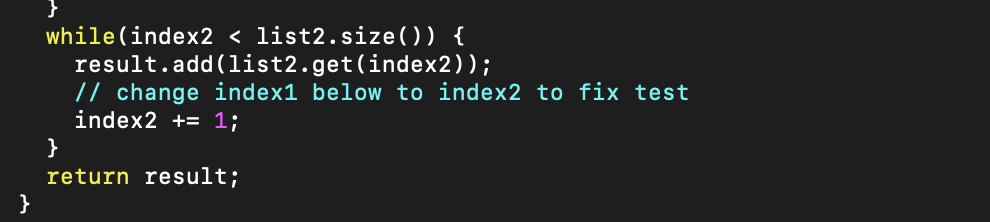
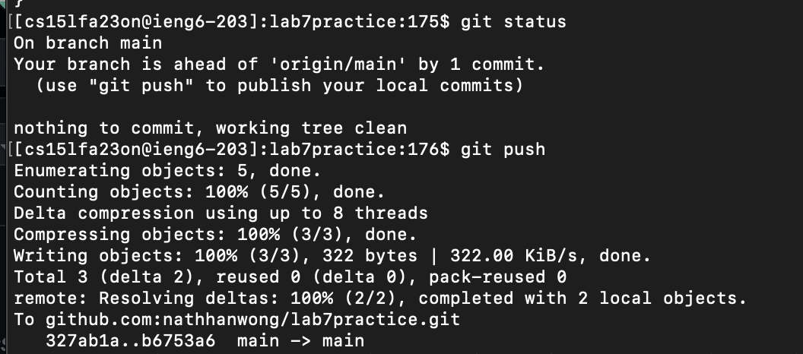

LAB REPORT 4 (VIM)

*BASELINE*

Step 1: Setup Delete any existing forks of the repository you have on your account

Step 2: Setup Fork the repository

Step 3: The real deal Start the timer!

Step 4: Log into ieng6

I ran ssh cs15lafa23on@ieng6.ucsd.edu to log into my ieng6 machine.

Step 5: Clone your fork of the repository from your Github account (using the SSH URL)

I then cloned the fork of the repository from Github account using git clone git@github.com:nathhanwong/lab7practice.git

Step 6: Run the tests, demonstrating that they fail

Ran javac ListExamples.java ListExamplesTests.java to demonstate that the .java files failed

Step 7: Edit the code file to fix the failing test

I entered Vim by pressing vim ListExamples.java
Then I proceded to press 40J to go down 40 lines then 11L to go right 11 times.
I then pressed "I" to enter insert mode then I typed 2, 
pressed l to move right 1 spot and the <delete> key to get rid of the previous 1.
Then I exited insert mode by pressing <esc? and typed in ":wq" to save my work and quit VIM.

Step 8: Run the tests, demonstrating that they now succeed

I ran java ListExamples ListExamplesTests where it ran successfully.

Step 9: Commit and push the resulting change to your Github account (you can pick any commit message!)

I then pressed git status and git push to push my local commits to GitHub.
