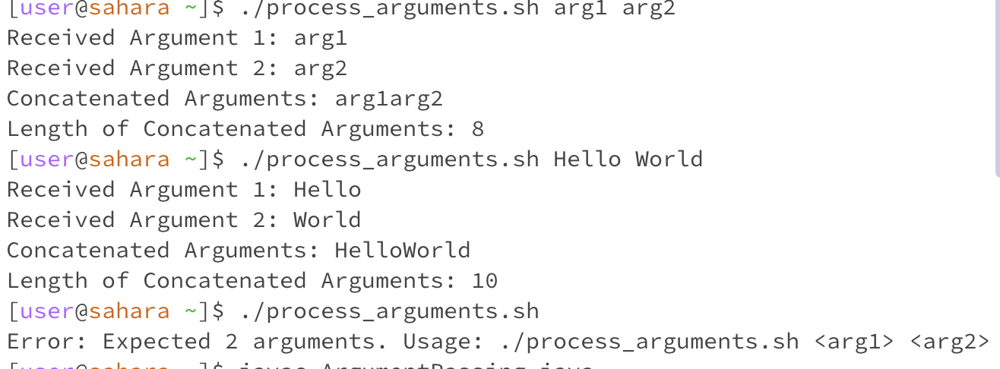
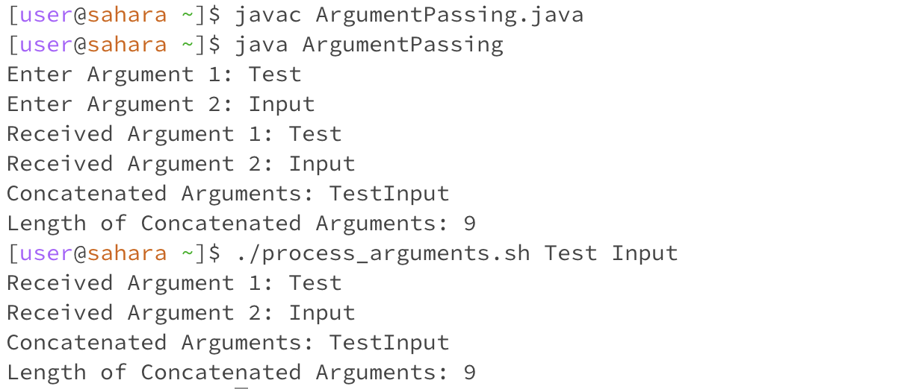

**LAB REPORT 5**

Step 1: *Student's Post*

Hey guys I have an issue with my Java program. It's not interacting
with the bash script properly. I keep getting an error message but 
I think the bug is coming from how my code is passing arguments 
to the bash script. Can someone help me?

Step 2: *Response from TA*

Hello! Thanks for sharing this message. To further diagnose the
issue, you should try running bash script manually with different
arguments in your terminal. Use the following command 
./process_arguments.sh "Test" "Input"
This command should execute the bash script 'process_arguments.sh'
with the arguments "Test" and "Input". Observe the output in the 
terminal and check if it works as expected. This will help determine
if the issue lies within the bash script or its interaction with the 
Java program. Let me know if there are any other questions!

Step 3:* Description of the bug*

After executing the ArgumentPassing.java program, I was prompted
to enter 2 arguments which would be initiated in the bash script.
The script received the arguments and displayed their reception, 
concatenated them, and calculated the length of the concatenated
string as expected. But the bug surfaced when the length was 
displayed incorrectly as the script producted an unexpected output
showing a length that didn't match the actual length.

Step 4: 
*File and Directory Structure Needed*-
Java File - "ArgumentPassing.java"
Bash Script "process_arguments.sh"

Contents of Each File Before Fixing Bug:
import java.io.BufferedReader;

import java.io.IOException;

import java.io.InputStreamReader;

public class ArgumentPassing {

    public static void main(String[] args) {
        try {
        
            BufferedReader reader = new BufferedReader(new InputStreamReader(System.in));
            
            System.out.print("Enter Argument 1: ");
            
            String argument1 = reader.readLine();
            
            System.out.print("Enter Argument 2: ");
            
            String argument2 = reader.readLine();
            
            ProcessBuilder processBuilder = new ProcessBuilder("./process_arguments.sh", argument1, argument2);
            Process process = processBuilder.start();

            BufferedReader scriptOutput = new BufferedReader(new InputStreamReader(process.getInputStream()));
            String line;
            while ((line = scriptOutput.readLine()) != null) {
                System.out.println(line);
            }

            process.waitFor();
        } catch (IOException | InterruptedException e) {
            e.printStackTrace();
        }
    }
}
 
*Bash Script * : 
#!/bin/bash

if [ "$#" -eq 2 ]; then

    echo "Received Argument 1: $1"
    
    echo "Received Argument 2: $2"

    concatenated="$1$2"
    echo "Concatenated Arguments: $concatenated"
    length=${#concatenated}
    echo "Length of Concatenated Arguments: $length"

else

    echo "Error: Expected 2 arguments. Usage: ./process_arguments.sh <arg1> <arg2>"
    exit 1
fi

*Command to Trigger Bug* : 
javac ArgumentPassing.java
java ArgumentPassing

*How to Fix Bug *:
I edited the incorrect length calcuation in the 'process_arguments.sh'
script. Specifically the part that calculates the length of the 
concatenated string. I ensured the length of the calculation
accurately reflected the length of the string by revising
the code logic in the script. By adjusting this, the issue with 
incorrect length display should be correct in the script output.

*Part 2: REFLECTION*
In the second half of this quarter, I encountered a plethora of new concepts
that significantly expanded my skill set. Engaging with various topics such as
Bash Scripting, autograding systems, executing commands from the command line,
and debugging processes have been a valuable learning curve. Each of these 
areas introduced a fresh perspective and hands-on experience which offered me
insights into the practical problem solving techniques and enhanching my 
proficiency in navigating within command line environments. This exposure not 
only broadened my technical capabilities but also provided a foundation for 
more efficient coding practices.
